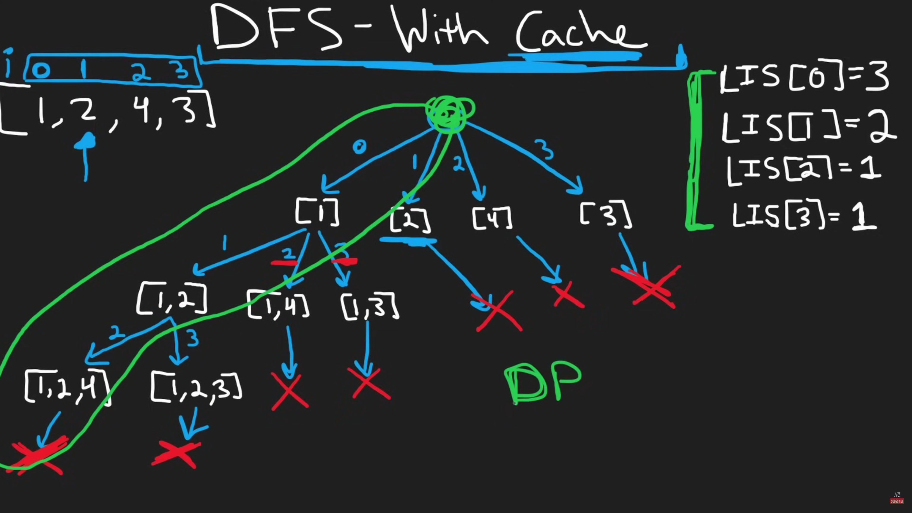

# Coin change problem

### Recursive solution

Function which takes in amount and the coins and returns the number of coins needed for that amount.
coinChangeHelper(coins *[]int, amount int, array *[]int) int 

loop over all the coins, and check how many coins for (amount - coin) are needed. 

Then we add 1 to that, because, let's say amount is 10. We have coins 2, and 8

we loop over 2 and 8, subtract 2 from 10, now we have 8. the number of coins required to make 10 is 1 + (number of coins required for 8)

```go
for _, coin := range *coins {
    if coin <= amount {
        c := coinChangeHelper(coins, amount-coin, array)

        // c + 1 as we used a coin here -> (amount - coin)
        if c >= 0 && c + 1 < minCoins {
            minCoins = c + 1
        }
    }
}
```

### Classic DP

Create an array of size amount + 1. We'll keep filling this array and array[i] is the amount of coins required to reach amount 'i'

Loop over amount using a, inner loop over all coins using c 

if (a - c) > 0 then we can use this coin.

```go
for i := 1; i < amount+1; i++ {
    for _, coin := range coins {
        if i-coin < 0 {
            continue
        }

        if i-coin == 0 {
            array[i] = 1
        } else {
            array[i] = min(array[i], array[i-coin]+1)
        }
    }
}
```


# Longest Common Subsequence

#### Always think of taking or not taking an element whenever solving Subsequence problems

str1 := "abcdefghij"
str2 := "ecdgi"

we can either "take" `e` or "not take" `e` in our LCS, similarly "take" `a` or "not take" `a` in the LCS

### Recursive Sol

```go
    // table = cache
	if i == len(*text1) || j == len(*text2) {
		return 0
	}

	if (*text1)[i] == (*text2)[j] {
        // taking from both as we found a common character
		val := 1 + lcs(text1, text2, i+1, j+1, table)
		return val
	}

    // Taking from str1 but not from str2
	left := lcs(text1, text2, i+1, j, table)

    // Taking from str2 but not from str1
	right := lcs(text1, text2, i, j+1, table)

    // return the longest of the two
	val := max(left, right)
```


# Longest Increasing Subsequence In an array

#### Always think of taking or not taking an element whenever solving Subsequence problems

array := [10, 9, 0, 1, 2, 3, 4]

decisiion tree -> we either take 10 or not take 10 -> then we either take 9 or not take 9

```go
// make sure to never send `base` here as you're basically saying the LIS has to start with base which is not true

func lis(nums []int, prevIndex int, currIndex int) int {
	n := len(nums)

	if currIndex == n {
		return 0
	}

	// Case 1: Exclude the current element
	exclude := lis(nums, prevIndex, currIndex + 1)

	// Case 2: Include the current element if it forms an increasing subsequence
	include := 0
	if prevIndex == -1 || nums[currIndex] > nums[prevIndex] {
		include = 1 + lis(nums, currIndex, currIndex + 1)
	}

	// Return the maximum of both cases
	return max(exclude, include)
}
```

This is what the decision tree looks like

 

So, our cache can look like 

`array[n]` where `array[i]` = the length of the Longest Increasing Subsequence starting at index `i`

```python
def lis(array: list[int]) -> list[int]:
    # lis_cache[i] = length of longest increasing subsequence that starts with lis_cache[i]   
    lis_cache = [1] * len(array)

    max_len_idx = 0

    # sequences = to build the LIS
    # sequences[i] the next index of array where the next element of LIS is
    sequences: list[None | int] = [None] * len(array)

    for i in range(len(array) - 1, -1, -1):
        for j in range(i + 1, len(array)):
            if array[i] < array[j] and 1 + lis_cache[j] > lis_cache[i]:
                lis_cache[i] = 1 + lis_cache[j]
                sequences[i] = j

        if lis_cache[i] > lis_cache[max_len_idx]:
            # to keep track of which number to start when building LIS sequence
            max_len_idx = i

    return build_sequence(array, sequences, max_len_idx)
```
