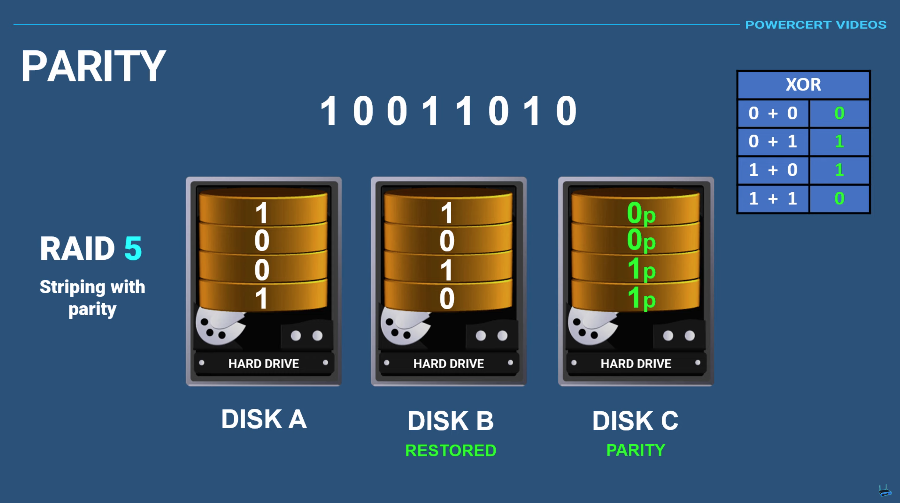
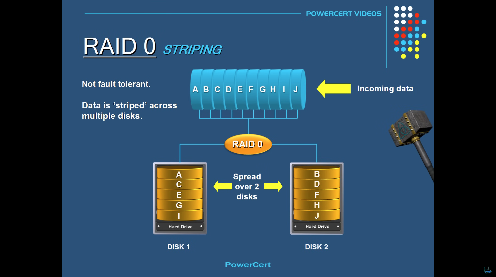
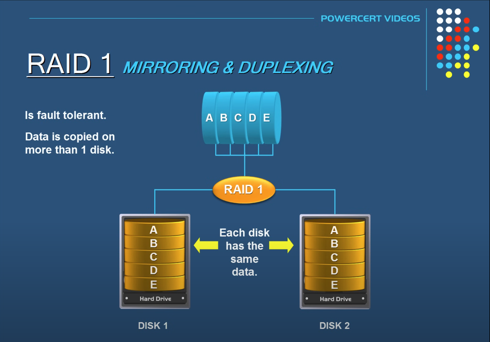
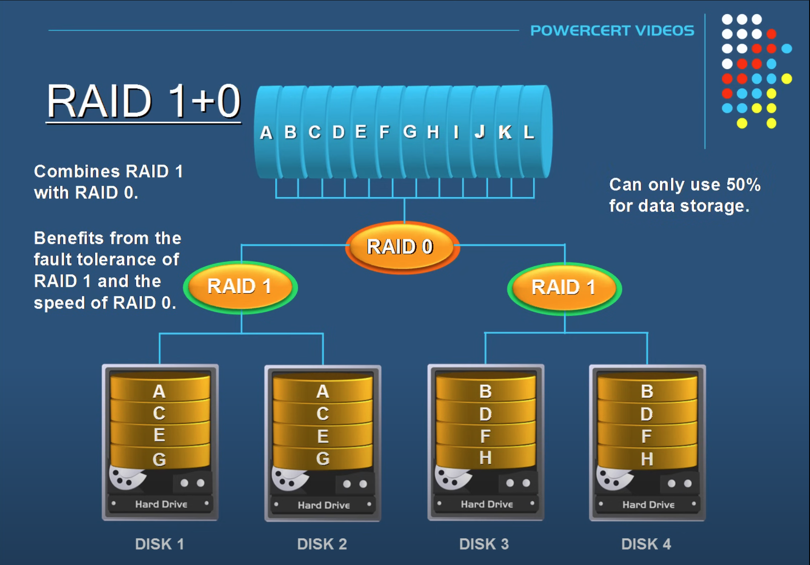
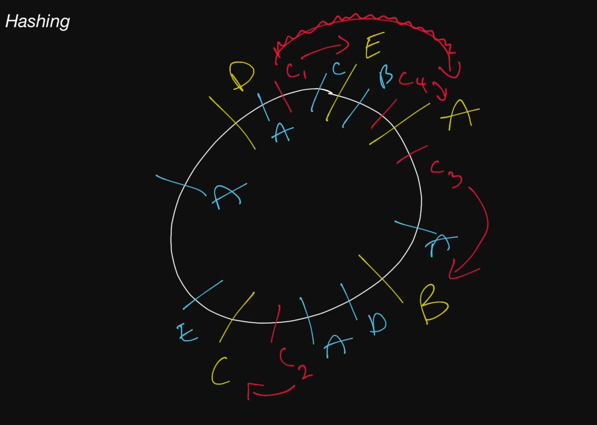

# DNS

### PTR -> Reverse DNS lookups

### Multiple A records
We can assign multiple A records in order to load balance at the domain level

DNS load balancers won't check if a server is online or not

# Clusters

Bunch of computers connected as nodes together. There is one master.
active-active clusters -> At least two nodes, both active and load balanced
active-passive cluster -> one active, one passive for failures

# LoadBalancers

We can deploy LBs in a cluster, where one can be active and other passive.

Layer4 -> can be used to route via IPs and stuff. Cannot read request data. Usually is a dedicated hardware piece
Layer7 -> used to read requests and then forward. Software

# Caches

### Write-through cache
Data written to cache and DB simultaniously. Fast retrieval, but higher write latency.

### Write around cache
data written to DB but read from cache. Increases cache misses, but lower write latency.

### Write-back cache
Data written to cache, and cache sends it to db. Reduces latency in high write throughput systems, risk of data loss.

### Cache Eviction policies
1. FIFO
2. LIFO
3. LRU
4. Most Recently used
When streaming video or audio, the most recently used content might be evicted first to make room for upcoming data, as it is less likely to be accessed again soon.
5. Least frequently used
6. Random replacement

# Load balancer vs Reverse Proxy
Load balancer is useful when we have multiple servers. Often, load balancers route traffic to a set of servers serving the same function,
while reverse proxies can be useful even with just one web server or application server.
A reverse proxy can also act as a load balancer but not the other way around.

# Raid

RAID (Redundant Array of Independent Disks) is a way of storing the same data on multiple hard disks or solid-state drives (SSDs) to protect data in the case of a drive failure.

### Parity
One disk is used for parity, which is basically just an XOR operation between the other two data disks so even if one disk fails, we can recover it using the parity and the intact disk.

There are different RAID levels, however, and not all have the goal of providing redundancy. Let's discuss some commonly used RAID levels:

+ **RAID 0**: Also known as striping, data is split evenly across all the drives in the array.

+ **RAID 1**: Also known as mirroring, at least two drives contains the exact copy of a set of data. If a drive fails, others will still work.

+ **RAID 5**: Striping with parity. Requires the use of at least 3 drives, striping the data across multiple drives like RAID 0, but also has a parity distributed across the drives.

+ **RAID 6**: Striping with double parity. RAID 6 is like RAID 5, but the parity data are written to two drives.

+ **RAID 10**: Combines striping plus mirroring from RAID 1 and RAID 0. It provides security by mirroring all data on secondary drives while using striping across each set of drives to speed up data transfers.

# Block Storage

Block storage divides data into blocks (chunks) and stores them as separate pieces. 
Each block of data is given a unique identifier, which allows a storage system to place the smaller pieces of data wherever it is most convenient.

Block storage also decouples data from user environments, allowing that data to be spread across multiple environments.
This creates multiple paths to the data and allows the user to retrieve it quickly.
When a user or application requests data from a block storage system, the underlying storage system reassembles the data blocks and presents the data to the user or application

# ACID vs BASE Consistency Model

**ACID** and **BASE** are two paradigms for managing consistency in database systems, particularly in distributed systems.

---

## 1. ACID (Atomicity, Consistency, Isolation, Durability)

- **Focus**: Strong consistency.
- **Use Case**: Relational databases and systems where data integrity is critical.

### Principles:
1. **Atomicity**: All operations in a transaction are completed, or none are. (All-or-nothing).
2. **Consistency**: The database moves from one valid state to another, maintaining data integrity.
3. **Isolation**: Transactions occur independently, avoiding interference.
4. **Durability**: Once a transaction is committed, it remains so even in case of failure.

### Example:
Banking systems:
- Transferring $100 from Account A to B requires:
  - Debit A
  - Credit B
- ACID ensures both steps complete or neither does, preventing data corruption.

### Pros:
- Reliable, predictable data.
- Suitable for applications requiring correctness (e.g., financial, medical).

### Cons:
- Scalability is limited in distributed systems due to high overhead.
- Slower due to strict consistency checks.

---

## 2. BASE (Basically Available, Soft state, Eventual consistency)

- **Focus**: High availability and eventual consistency.
- **Use Case**: Distributed systems and NoSQL databases where performance and fault tolerance are prioritized.

### Principles:
1. **Basically Available**: The system is always available, even during partial failures.
2. **Soft state**: The state of the system might not be consistent at all times.
3. **Eventual consistency**: The system will become consistent over time, assuming no further updates.

### Example:
Shopping cart in an e-commerce application:
- A user’s cart updates are propagated across nodes asynchronously.
- Temporary inconsistencies (e.g., two nodes showing different cart contents) are acceptable as long as eventual consistency is achieved.

### Pros:
- High availability and partition tolerance.
- Better suited for distributed systems with massive scale (e.g., Amazon DynamoDB, Cassandra).

### Cons:
- Temporary inconsistencies can lead to stale reads.
- Application logic may need to handle inconsistencies.

---

## Key Differences

| **Aspect**          | **ACID**                        | **BASE**                          |
|----------------------|----------------------------------|-----------------------------------|
| **Consistency**      | Strong consistency              | Eventual consistency             |
| **Availability**     | Lower during conflicts          | High availability                |
| **Scalability**      | Less scalable                   | Highly scalable                  |
| **Speed**            | Slower due to strict checks     | Faster due to relaxed constraints |
| **Use Case**         | Financial, healthcare systems   | Social media, e-commerce systems |

---

## Summary
- **ACID**: Ensures correctness and reliability at the cost of performance and scalability.
- **BASE**: Optimizes for availability and performance, tolerating temporary inconsistencies. Choose based on the system's requirements for consistency, availability, and scalability.

# Columnar Databases

Columnar databases store data by columns instead of rows, making them well-suited for analytical workloads. Here are the key advantages:

---

## 1. Faster Query Performance for Analytical Workloads
- **Advantage**: Queries involving aggregations or scans over specific columns (e.g., `SUM`, `AVG`, `COUNT`) are faster since only the relevant columns are accessed, not entire rows.
- **Example**: 
  - **Query**: Calculate total sales.
  - In a columnar database, only the "sales" column is read, reducing I/O and improving speed.

---

## 2. Efficient Data Compression
- **Advantage**: Data in a single column often has similar types and ranges, allowing better compression compared to row-based databases.
- **Example**:
  - A "gender" column with values `Male`/`Female` compresses efficiently using run-length encoding.
  - Columnar databases like **Parquet** and **Apache ORC** achieve significant storage savings.

---

## 3. Optimized Storage and Reduced I/O
- **Advantage**: By reading only the relevant columns, unnecessary I/O is minimized, improving performance for large datasets.
- **Example**: 
  - **Query**: Analyze user demographics (`age`, `location`) in a 1-billion-row dataset.
  - Columnar storage reads only the `age` and `location` columns, skipping unrelated ones like `purchase_date`.

---

## 4. Parallel Processing
- **Advantage**: Columns are stored independently, allowing queries to process columns in parallel.
- **Example**:
  - In **Google BigQuery**, querying across multiple columns can be executed in parallel, drastically reducing query execution time.

---

## 5. Better Support for Sparse Data
- **Advantage**: Columnar databases handle sparse data efficiently by storing only the present values for columns, skipping null or default values.
- **Example**:
  - In a dataset with optional fields (e.g., `phone_number`, `email`), columnar storage avoids allocating space for unused fields.

---

## 6. Ideal for OLAP Workloads
- **Advantage**: Columnar databases are optimized for Online Analytical Processing (OLAP), where data aggregation and slicing are common.
- **Example**: 
  - **Amazon Redshift** and **ClickHouse** excel at running analytical dashboards for business intelligence.

---

## 8. Flexibility for Partition Pruning
- **Advantage**: Columnar databases can quickly exclude irrelevant partitions by scanning only required columns.
- **Example**:
  - In **Snowflake**, querying a time-series dataset for specific months only scans the partitions containing the relevant time range.

---

## Examples of Columnar Databases
1. **Apache Cassandra** (Column Family Store)
2. **Amazon Redshift**
3. **Google BigQuery**
4. **ClickHouse**
5. **Apache Parquet** (columnar file format for data lakes)

---

# Vector Databases

Vector databases are specialized databases designed to store, index, and query high-dimensional vector data. They are particularly useful for machine learning, AI applications, and scenarios where similarity searches are essential.

## Use Cases of Vector Databases

### 1. **Recommendation Systems**
- **Example**: E-commerce platforms can recommend products by comparing the user's preference vector to product vectors.

### 2. **Semantic Search**
- **Example**: Search engines use vector embeddings of text to return semantically similar results, even if the exact keywords differ.

### 3. **Image and Video Search**
- **Example**: Search for images similar to a given one using embeddings generated by computer vision models.

### 4. **Anomaly Detection**
- **Example**: Detect unusual patterns in data by identifying vectors that deviate significantly from the norm.

### 5. **Natural Language Processing**
- **Example**: Powering chatbots and virtual assistants by matching user input vectors to response vectors.

# CAP Theorem

### Consistency
Consistency means that all clients see the same data at the same time, no matter which node they connect to. For this to happen, whenever data is written to one node, it must be instantly forwarded or replicated across all the nodes in the system before the write is deemed "successful".

### Availability
Availability means that any client making a request for data gets a response, even if one or more nodes are down.

### Partition tolerance
Partition tolerance means the system continues to work despite message loss or partial failure. A system that is partition-tolerant can sustain any amount of network failure that doesn't result in a failure of the entire network. Data is sufficiently replicated across combinations of nodes and networks to keep the system up through intermittent outages.

## Consistency-Availability Tradeoff
We live in a physical world and can't guarantee the stability of a network, so distributed databases must choose Partition Tolerance (P). This implies a tradeoff between Consistency (C) and Availability (A).

### CA database
A CA database delivers consistency and availability across all nodes. It can't do this if there is a partition between any two nodes in the system, and therefore can't deliver fault tolerance.

### CP database
A CP database delivers consistency and partition tolerance at the expense of availability. When a partition occurs between any two nodes, the system has to shut down the non-consistent node until the partition is resolved.

### AP database
An AP database delivers availability and partition tolerance at the expense of consistency. When a partition occurs, all nodes remain available but those at the wrong end of a partition might return an older version of data than others. When the partition is resolved, the AP databases typically re-syncs the nodes to repair all inconsistencies in the system.

# Distributed Transactions

# Consistent Hashing
Consider servers in a cirle, just a way to think about it. Then we simply move clockwise to the closest server
Adding or removing nodes don't change the servers that the previous requests go to.

If we decide to make server `A` beefier, then we can add `A` to another point on the circle and consider it as a `virtual node`.

# Randezvoud Hashing
We calculate some weight for our servers that's going to be Independent of how many servers we have. 

# Message queues

### Push or Pull Delivery
Most message queues provide both push and pull options for retrieving messages.
Pull means continuously querying the queue for new messages.
Push means that a consumer is notified when a message is available.
We can also use long-polling to allow pulls to wait a specified amount of time for new messages to arrive.

### At-Least-Once Delivery
Message queues may store multiple copies of messages for redundancy and high availability,
and resend messages in the event of communication failures or errors to ensure they are delivered at least once.

### Dead-letter Queues
A dead-letter queue is a queue to which other queues can send messages that can't be processed successfully.
This makes it easy to set them aside for further inspection without blocking the queue processing or spending CPU cycles on a message that might never be consumed successfully.

# Event-Driven Architecture (EDA)
Event-Driven Architecture (EDA) is about using events as a way to communicate within a system.
Generally, leveraging a message broker to publish and consume events asynchronously.
The publisher is unaware of who is consuming an event and the consumers are unaware of each other.
Event-Driven Architecture is simply a way of achieving loose coupling between services within a system.

# Event Sourcing
Instead of storing just the current state of the data in a domain, use an append-only store to record the full series of actions taken on that data.
The store acts as the system of record and can be used to materialize the domain objects.

For examples, instead of storing the number of items in a cart, we can store the following events

1. Add Item 1
2. Add Item 50
3. Remove Item 3

We can build our data from these events.

# Api Gateways

+ Authentication and Authorization
+ Service discovery
+ Reverse Proxy
+ Caching
+ Security
+ Retry and Circuit breaking
+ Load balancing
+ Logging, Tracing
+ API composition
+ Rate limiting and throttling
+ Versioning
+ Routing
+ IP whitelisting or blacklisting

-----------------------------------------------------------------------------------------------------------------------------

Again
https://github.com/karanpratapsingh/system-design?tab=readme-ov-file#distributed-transactions
https://github.com/karanpratapsingh/system-design?tab=readme-ov-file#command-and-query-responsibility-segregation-cqrs
