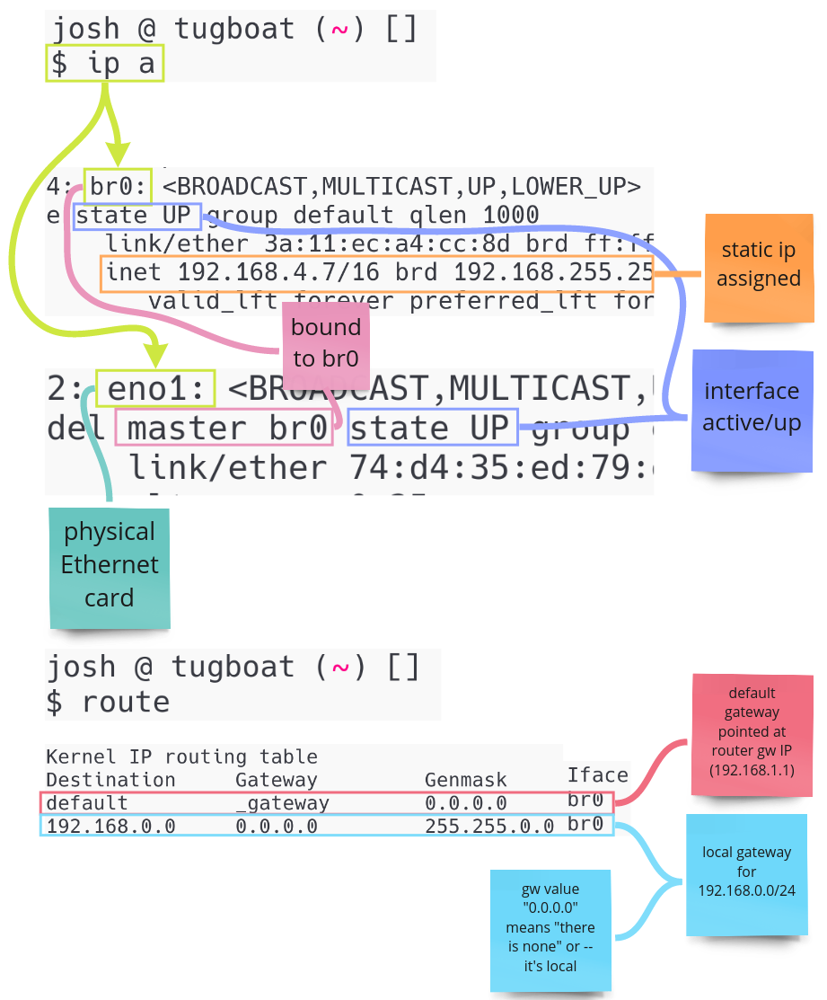

# Libvirt's Default Network

Libvirt has a `default` Network by default

```sh
sudo virsh net-list --all                                                                                                              ✔ 


 Name      State      Autostart   Persistent
----------------------------------------------
 default   inactive   no          yes
```

### Start the default Network

```bash
sudo virsh net-start default
"Network default started"

# A new network interface is created

5: virbr0: <BROADCAST,MULTICAST,UP,LOWER_UP> mtu 1500 qdisc htb state UP group default qlen 1000
    link/ether 52:54:00:9f:89:3a brd ff:ff:ff:ff:ff:ff
    inet 192.168.122.1/24 brd 192.168.122.255 scope global virbr0
       valid_lft forever preferred_lft forever
```

Another thing that's been set up for is a process called `dnsmasq`

```bash
nobody 8419  0.0  0.0  11916  2308 ? S   /usr/bin/dnsmasq --conf-file=/var/lib/libvirt/dnsmasq/default.conf --leasefile-ro --dhcp-script=/usr/lib/lib virt/libvirt_leaseshelper
nobody 8419  0.0  0.0  11916  2308 ? S   /usr/bin/dnsmasq --conf-file=/var/lib/libvirt/dnsmasq/default.conf --leasefile-ro --dhcp-script=/usr/lib/li bvirt/libvirt_leaseshelper
root   8420  0.0  0.0  11916  1748 ? S   /usr/bin/dnsmasq --conf-file=/var/lib/libvirt/dnsmasq/default.conf --leasefile-ro --dhcp-script=/usr/lib/lib virt/libvirt_leaseshelper
root   8420  0.0  0.0  11916  1748 ? S   /usr/bin/dnsmasq --conf-file=/var/lib/libvirt/dnsmasq/default.conf --leasefile-ro --dhcp-script=/usr/lib/libvirt/libvirt_leaseshelper
```

This acts as a DHCP server for us which assigns IP addrs to VMs

```bash
sudo cat /var/lib/libvirt/dnsmasq/default.conf

##WARNING:  THIS IS AN AUTO-GENERATED FILE. CHANGES TO IT ARE LIKELY TO BE
##OVERWRITTEN AND LOST.  Changes to this configuration should be made using:
##    virsh net-edit default
## or other application using the libvirt API.
##
## dnsmasq conf file created by libvirt
strict-order
pid-file=/run/libvirt/network/default.pid
except-interface=lo
bind-dynamic
interface=virbr0
dhcp-range=192.168.122.2,192.168.122.254,255.255.255.0
dhcp-no-override
dhcp-authoritative
dhcp-lease-max=253
dhcp-hostsfile=/var/lib/libvirt/dnsmasq/default.hostsfile
addn-hosts=/var/lib/libvirt/dnsmasq/default.addnhosts
```


# What happens when we start up a VM

A new network interface is created

```bash
# A new network interface is created when I start a VM `virsh start fedora-coreos-stable`
# This is also a `tap interface`

6: vnet0: <BROADCAST,MULTICAST,UP,LOWER_UP> mtu 1500 qdisc noqueue master virbr0 state UNKNOWN group default qlen 1000
    link/ether fe:54:00:1d:1e:d7 brd ff:ff:ff:ff:ff:ff
    inet6 fe80::fc54:ff:fe1d:1ed7/64 scope link proto kernel_ll 
       valid_lft forever preferred_lft forever
```

## A vnet0 tap interface is created and attached to virbr0.

- This interface attached to the `qemu-system-x86_64` process.
- It enables traffic to flow between the VM to the host's network stack.
- All new VMs get one of these interfaces. The next VM would get `vnet1`.
- Since `vnet*` interfaces are attached to the bridge VMs are routable in the host.

## A new `qemu-system-x86_64` process is started for the VM.

- This process is attached to the `vnet0` tap interface.

- By identifying a VMs pid and browsing its file descriptor info, you can see this attachment.

```bash
ps aux | rg -i 'name guest=fedora*'

libvirt+   13169  1.0  0.3 2680496 150788 ?      Sl   12:17   1:37 /usr/bin/qemu-system-x86_64 -name guest=fedora-coreos-stable,debug-threads=on ...


# Checking the fds for this process

cat /proc/13169/fdinfo/34

pos:    100
flags:  0104002
mnt_id: 27
ino:    553
iff:    vnet0 # connected to vnet0 interface. idk why iff stands for interface

# If we check the fd 34, it's linked to /dev/net/tun
lrwx------ 1 libvirt-qemu libvirt-qemu 64 Apr 18 14:51 ../fd/34 -> /dev/net/tun
```

## Looking at what IP and MacAddresses are allocated to VMs

```bash
virsh net-dhcp-leases default


 Expiry Time           MAC address         Protocol   IP address           Hostname   Client ID or DUID
------------------------------------------------------------------------------------------------------------------------------------------------
 2025-04-18 22:20:15   52:54:00:37:3e:bc   ipv4       192.168.122.212/24   ubuntu     ff:56:50:4d:98:00:02:00:00:ab:11:fa:ba:85:b7:f2:97:38:07
```

## If we look at the route table

```bash
route

Kernel IP routing table
Destination     Gateway         Genmask         Flags Metric Ref    Use Iface
default         _gateway        0.0.0.0         UG    600    0        0 wlp4s0
192.168.1.0     0.0.0.0         255.255.255.0   U     600    0        0 wlp4s0
192.168.122.0   0.0.0.0         255.255.255.0   U     0      0        0 virbr0 # this is our VM bridge

# gateway 0.0.0.0 kinda means there is no gateway, and it all happens locally
```

# Let's say we've deleted all of our interfaces

```bash
# Take the eno1 interface DOWN
sudo ip link set eno1 down

# Remove the IP addr associated to eno1
sudo ip addr del 192.168.1.125/16 dev eno1

# Stop all systemd network services
sudo systemctl stop NetworkManager
sudo systemctl stop systemd-networkd
```

```bash
$ ip a s

1: lo: <LOOPBACK,UP,LOWER_UP> mtu 65536 qdisc noqueue state UNKNOWN group default qlen 1000
    link/loopback 00:00:00:00:00:00 brd 00:00:00:00:00:00
    inet 127.0.0.1/8 scope host lo
       valid_lft forever preferred_lft forever
    inet6 ::1/128 scope host
       valid_lft forever preferred_lft forever

2: eno1: <BROADCAST,MULTICAST> mtu 1500 qdisc noop state DOWN group default qlen 1000 # this is down and has no IP
    link/ether 74:d4:35:ed:79:d7 brd ff:ff:ff:ff:ff:ff
    altname enp0s25

3: wlp5s0: <BROADCAST,MULTICAST> mtu 1500 qdisc noop state DOWN group default qlen 1000 # this is down and has no IP
    link/ether d8:f2:ca:d5:8c:b6 brd ff:ff:ff:ff:ff:ff
```

### We'll set up a bridge network all manually

```bash
# Add a bridge device
# This is like establising a virtual switch in the form a bridge interface.
ip link add name br0 type bridge


# br0 is now our virtual switch.
# We want everything, including the host's ethernet device to "plug" into it.
# To do this, we'll bind your ethernet device's interface to br0.

# Bind eno1 to the bridge we just created
ip link set eno1 master br0
```

br0 needs an IP address.
Normally we'd rely on DHCP to provide this. For now, assign an IP to the interface and setup its broadcast domain (brd).
Make sure this IP is not in use elsewhere in your network.

```bash
ip addr add 192.168.4.7/16 dev br0 brd 192.168.255.255
```


While an IP is in place, br0 and eno1 are still DOWN. Next, change the link state of both to UP.

```bash
ip link set up eno1 && ip link set up br0
```

Now the interfaces are up.
If all went correctly, you can use another host on the LAN and run an arping against the IP address you assigned and verify this host's MAC address responds.

```bash
root@some-random-computer [ ~ ]# arping -I eth0 192.168.4.7

ARPING 192.168.4.7 from 192.168.2.91 eth0
Unicast reply from 192.168.4.7 [3A:11:EC:A4:CC:8D]  0.759ms
Unicast reply from 192.168.4.7 [3A:11:EC:A4:CC:8D]  0.816ms
```


The host is now reachable, however it can't reach outside the LAN.
This is because there is default route established for traffic that is outside of 192.168.0.0/16.
This can be seen by looking at the route table.

```bash
$ route

Kernel IP routing table
Destination     Gateway         Genmask         Flags Metric Ref    Use Iface
192.168.0.0     0.0.0.0         255.255.0.0     U     0      0        0 br0
```

Add a route for the default gateway pointed at your router's gateway IP.

```bash
route add default gw 192.168.1.1
```

# Bridge Arch


